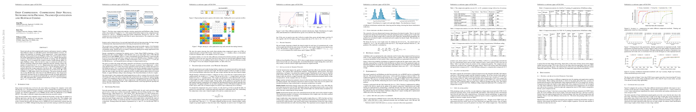

# Deep Compression: Compressing Deep Neural Networks with Pruning, Trained Quantization and Huffman Coding
- author:
- year: 2015
- citation: 16 (2016年5月25日 時点)
- [pdf](http://arxiv.org/pdf/1510.00149v5.pdf)

This thumbnail was generated by [paper2tmb](https://github.com/sotetsuk/paper2tmb) from [this page](http://arxiv.org/pdf/1510.00149v5.pdf)

## 1. どんなもの？
## 2. 先行研究と比べて何がすごい？
## 3. 技術や手法のキモはどこ？
## 4. どうやって有効だと検証した？
## 5. 議論はある？
## 6. 次に読むべき論文は？
