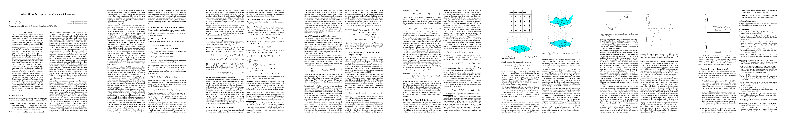

# Algorithms for inverse reinforcement learning.
- author: Ng, Andrew Y and Russell, Stuart J
- year: 2000
- citation: 684 (2016年5月23日 時点)
- [pdf](http://ai.stanford.edu/~ang/papers/icml00-irl.pdf)
- [強化学習勉強会資料 by 池田くん（自分用）](https://drive.google.com/file/d/0B-OHcMrFyg1zWlJEdS1mUVp6TFk/view?usp=sharing)

This thumbnail was generated by [paper2tmb](https://github.com/sotetsuk/paper2tmb) from [this page](http://ai.stanford.edu/~ang/papers/icml00-irl.pdf)

## 1. どんなもの？
## 2. 先行研究と比べて何がすごい？
## 3. 技術や手法のキモはどこ？
## 4. どうやって有効だと検証した？
## 5. 議論はある？
## 6. 次に読むべき論文は？
