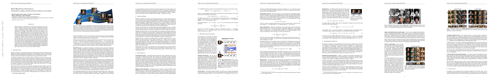

# Deep Manifold Traversal: Changing Labels with Convolutional Features
- author: Gardner et al.
- year: 2015
- citation: 2 (2016年8月 時点)
- [pdf](http://arxiv.org/pdf/1511.06421) (v1)

This thumbnail was generated by [paper2tmb](https://github.com/sotetsuk/paper2tmb) from [this page](http://arxiv.org/pdf/1511.06421)

## 1. どんなもの？
- MLやCVのいくつかのタスクはラベルチェンジだと捉えられる
  - どの特徴量が入院患者が再入院するのに効くか？
  - https://github.com/alexjc/neural-doodle/issues/66
- ただ、その一方でadversarial exampleの例からわかるように、ちょっとデータ空間でサンプルを動かせば"健康"になるわけではない（健康（パンダ以外）に見せかけて実際は明らかに病気（パンダ）のまま、という状態を容易に作り出せる）
- そこでこの研究では、 ラベルを **truly change** するために、 **meaningful change** を入力データに対して施すことを目標としている

## 2. 先行研究と比べて何がすごい？
- かなりシンプルな手法で、汎用性が高いと感じた（別にDNN自体はこのタスク専用に学習をしているわけではない）
- しかも明示的な（人手での）アノテーションや、ターゲットの（一枚の）画像を選ぶ必要もない
- semanticの変化も捉えられているように見える

## 3. 技術や手法のキモはどこ？

- 一回deepで学習をしたz空間に移してからラベルチェンジをして、元にもどしてる（ここで移すときに正則化を入れてるのも結構見た目に効いてるっぽい）
- z空間で動かすときには、単純に出力確率を変える方向に動かすのではなく、MMD（Maximum Mean Discrepancy）というのを使ってargminする関数を決めている

### MMD
- 分布p, qのが同じかどうかを検定するための手法
- x 〜 p, y 〜 q として、v = E[f(x)] - E[(f(y))]を最大にするfを求め、そのfによるvをMMDとする。fはカーネルトリックを使って求まる。
- fは、pから生成されてるっぽいサンプルなら大きくなるように、qから生成されてるっぽいサンプルなら小さくなるように決まっている。この論文では、このfによってサンプルがどちらの分布から出ているっぽいかの指標を作っている

## 4. どうやって有効だと検証した？

- v3では他の類似手法と比較をしている、その上で人手でのアノテーションが不要といった主張をしている
- 設定もバリエーションを増やして、定性的に見た目で凄さを訴えている

## 5. 議論はある？

- 何を持って **truly change** と言うのかが難しいと思った（画像なので明らかなように感じるが他のデータセットだと難しい）
  - Adversarial exampleとの関係を考えると、ラベル（出力確率）は変えるが、他の保存されるべき性質（what?）は変わらないように正則化をかける必要がありそうだと感じた
- MMDを使ったのは、adversarialみたいにPについてargminを取るのとそんなに違うのか？（truly changeたらしめるのか？）他の指標とかは考えられないのか？
- **Manifoldを使ってはいるけどlearningはしてない**

## 6. 次に読むべき論文は？

##### Szegedy et al., 2013

- Deep Neural Networks for Object Detection
- ラベルを変えるタスクに関連

##### Yu et al. 2013
- どの特徴量が入院患者が再入院するかに効くかのデータ扱っている
- どう良いほうに変えたら良いか分かる、という文脈での引用

##### Cui et al., 2015 (KDD)
- Optimal action extraction for random forests and boosted trees.

> This paper derives an actionable plan to change an input to a certain class via random forests or tree boostings through a linear program.

##### MMD: Maximum Mean Discpepancy

- 二つの分布が同じかどうかテストする
  - Fortet & Mourier 1953
  - Li et al., 2015 (in deep learning)
  - Gretton et al., 2012
