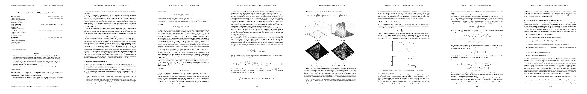

# How to explain individual classification decisions
- author:
- year: 2010
- citation: 48 (2016年6月 時点)
- [pdf](http://www.jmlr.org/papers/volume11/baehrens10a/baehrens10a.pdf)

This thumbnail was generated by [paper2tmb](https://github.com/sotetsuk/paper2tmb) from [this page](http://www.jmlr.org/papers/volume11/baehrens10a/baehrens10a.pdf)
## 1. どんなもの？
## 2. 先行研究と比べて何がすごい？
## 3. 技術や手法のキモはどこ？
## 4. どうやって有効だと検証した？
## 5. 議論はある？
## 6. 次に読むべき論文は？
