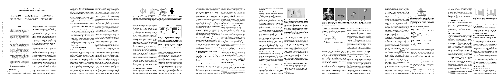

# "Why Should I Trust You?": Explaining the Predictions of Any Classifier
- author:
- year: 2016
- citation: 1 (2016年6月 時点)
- [pdf](http://arxiv.org/pdf/1602.04938)

This thumbnail was generated by [paper2tmb](https://github.com/sotetsuk/paper2tmb) from [this page](http://arxiv.org/pdf/1602.04938)

## 1. どんなもの？
- 任意の識別器を局所で説明する手法を提案した（LIME)
- 代表的な点をとってくることで、モデル全体としての信頼度を測ることも可能な手法を提案した（SP_LIME）

## 2. 先行研究と比べて何がすごい？
- 個別の予測を説明できるだけでなく、劣モジュラで代表的なサンプルをいくつかとってくることで、モデル自体の信頼度を測ることを可能にした（SP-LIME）
- （手法を使えるようにgithub上できちんと公開している）

## 3. 技術や手法のキモはどこ？
- 各局所でサンプルを生成してそのまわりでの識別器の挙動を調べている
- 劣モジュラで代表的な点をとってくる

## 4. どうやって有効だと検証した？
- 実際に有名な20 newsgroupsのデータセットにおいて、識別性能は出ているが、判断の根拠が文脈と関係ない例を示した。

## 5. 議論はある？
## 6. 次に読むべき論文は？
