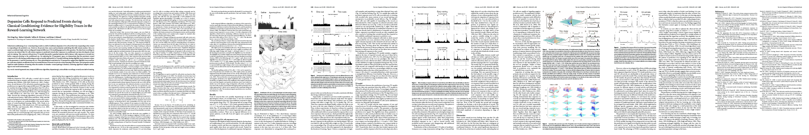

# Dopamine cells respond to predicted events during classical conditioning: evidence for eligibility traces in the reward-learning network
- author: Pan, Wei-Xing and Schmidt, Robert and Wickens, Jeffery R and Hyland, Brian I
- year: 2005
- citation: 264 (2016年5月23日 時点)
- [html](http://www.jneurosci.org/content/25/26/6235.long)
- [研究室での櫻井くんの発表資料(自分用）](https://drive.google.com/file/d/0B-OHcMrFyg1zaXBTMmpiNDBXSmM/view?usp=sharing)

[
This thumbnail was generated by [paper2tmb](https://github.com/sotetsuk/paper2tmb) from [this page](http://jn.physiology.org/content/jn/80/1/1.full.pdf)

## 1. どんなもの？
- ラットの電気生理実験から、Schultz et al., 1997のモデルTD(0)がDA cellのモデルとして合致しない点があることを示した。 
- DA cellのモデルをTD(0)ではなく、TD(λ)でたてた。先の電気生理実験の結果を再現することを確認した。
- パラメータはλが大きく、学習率が小さいものがフィットすることを確認した。

## 2. 先行研究と比べて何がすごい？
- Schultz et al. (1997)では、DA cellの働きをTD(0)で説明した。
- 既存のTD学習によるモデルの問題点（この論文の主張と異なる点）:
  - 既存のモデルは、rewardに対するresponseが失われてから、段々キューのタイミングに近づいてい(Montague et al., 1996, Schultz et al., 1997)
    - が、実際の観測では、キューに対する反応が確認されても（少なくとも初期は）rewardに対するresponseは失われていない
  - intermediate redundant cue（二つ目の余分なcue）は学習の過程では予測に考慮されていない(Montague et al., 1996, Schultz et al., 1997)
- TD(λ)の方がよりDA cellのモデルとして相応しそうだということを示した。
  - しかもλは結構大きい

## 3. 技術や手法のキモはどこ？
- 電気生理実験によって、先行研究のモデルでは説明できない現象を観測した:
  - rewardに対する反応が失われてからキューに対する反応が獲得される（徐々にシフトしていく）
  - redundant cueが予測に寄与しない

## 4. どうやって有効だと検証した？

### わからないもの

### Fig.2
- TD(0)のモデルの結果と違い、すぐにcueに対する反応が観測された（one-cue, two-cue 双方で）
  - [主張] 既存のモデルはおかしいのでは？
- 2つのcue双方に対して反応が見られた
  - [主張] 先行研究のモデルが正しければ二つ目のcueは反応しないはずでは？
- また、TD(0)のモデルの結果と違い、cueに対する反応が学習された後でも、rewardに対する反応が残っている
  - => 詳しくみるためにFig.3へ

### Fig.3
- early training (A)とlate training (B)の比較
- late trainingではrewardに対して反応しなくなっている（B, middle）が、cueがなかったりsecond-cueがなかったりすると反応する（B, left, right）
  - [主張] 学習が進んで、cueに対する反応が出るようになってから、rewardに対する反応がなくなる。
- earlyでもlateでも、2nd-cueが除かれた時のrewardに対する反応の大きさは、randam-rewardの時と変わらない
  - [主張]1つめのcueの存在が2つめのcueの学習を妨げることはない（2つめのcueもきっちり予測で考慮されている）
  - この主張は先行研究と異なる
- 明瞭ではないが、2nd-cueが除かれた時にも負の反応が観測された（いくつかのニューロンで）
  - （これも説明できるようなモデルを立てる）

### Fig.4
- λ=0.9の時は、1st-cue, 2nd-cue, rewardのそれぞれの時刻で段々と反応が学習されていく（Fig.3の結果・主張と合致）
  - λ=0の時は違う

## 5. 議論はある？
- Schultz et al., 1997にも言えることだが、そもそもCSから何ステップ後か、という特徴量について線形な価値関数というのは適切なの？

## 6. 次に読むべき論文は？

##### Schultz, 1998
> Midbrain dopamine (DA) cells play a central role in rewardmediated learning in animals, and their activity follows classical learning rules (Schultz, 1998, 2002; Waelti et al., 2001) 

> A TD mechanism that has been suggested to underlay this process involves a stepwise shift in the timing of prediction error signal, so that it drifts gradually in latency until it follows the cue (Montague et al., 1996; Schultz et al., 1997).

##### Schultz et al., 1997
> Furthermore, several features of DA cell activity match properties of the prediction error signal of the temporal difference (TD) algorithm for machine learning, leading to the hypothesis that DA cell activity may be providing a teaching signal within a neural analog of a TD learning system in the brain (Houk et al., 1995; Montague et al., 1996; Schultz et al., 1997; Daw et al., 2003; Nakahara et al., 2004). 

