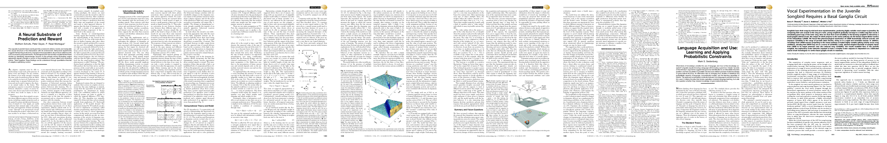

# A neural substrate of prediction and reward
- author: Schultz, Wolfram and Dayan, Peter and Montague, P Read
- year: 1997
- citation: 5089 (2016年5月27日 時点)
- [pdf](http://citeseerx.ist.psu.edu/viewdoc/download?doi=10.1.1.133.6176&rep=rep1&type=pdf)
- [強化学習勉強会・論文紹介](http://www.slideshare.net/sotetsukoyamada/22-62639753)

This thumbnail was generated by [paper2tmb](https://github.com/sotetsuk/paper2tmb) from [this page](http://citeseerx.ist.psu.edu/viewdoc/download?doi=10.1.1.133.6176&rep=rep1&type=pdf)

## 1. どんなもの？
- サルの電気生理実験において、中脳(のVTA)のDorpamine neuronがただ報酬に関連した活動を示すだけでなく、報酬の予測からの誤差を表していることを示した。
- また、その予測誤差のモデルとしてTD学習が使えるのではないかと提案した。

## 2. 先行研究と比べて何がすごい？
## 3. 技術や手法のキモはどこ？
## 4. どうやって有効だと検証した？
## 5. 議論はある？
## 6. 次に読むべき論文は？

